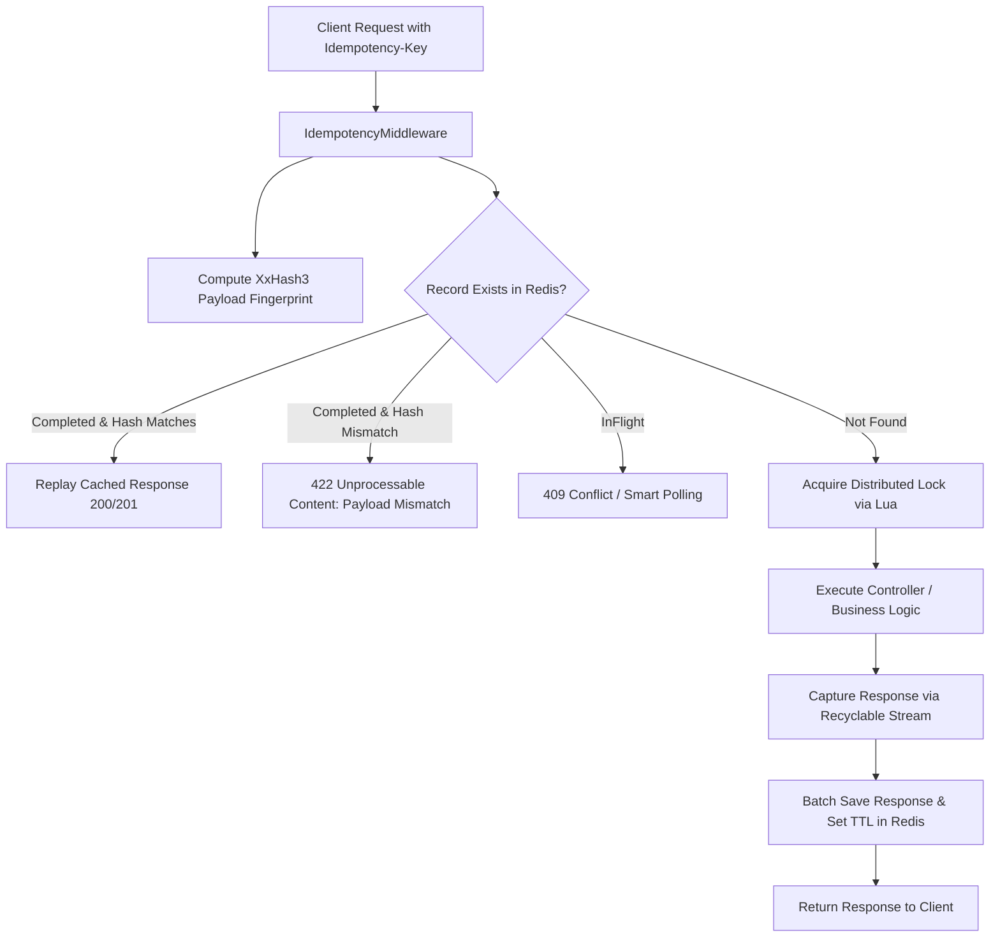

# FastIdempotency

⚡ High-Performance, Distributed Idempotency Middleware for ASP.NET Core (.NET 8).

When network timeouts, client retries, or duplicate webhooks hit your API, duplicate processing can cause critical bugs (such as double-charging a customer or duplicating inventory orders).

**FastIdempotency** guarantees that no matter how many retries arrive with the same `Idempotency-Key` header:
- The operation executes **exactly once**.
- Subsequent duplicate requests receive the **cached response** immediately.
- Payloads are validated against a SIMD-accelerated **XxHash3** fingerprint to reject malicious/accidental key reuse (HTTP `422 Unprocessable Content`).
- Distributed concurrency is safely handled using atomic Lua scripts in **Redis** or row-level locking in **PostgreSQL**.

---

## 📊 End-to-End Performance Benchmarks

*Hardware: 11th Gen Intel Core i7-11800H @ 2.30GHz (8 cores / 16 threads), .NET 8.0 RyuJIT x64, Windows 11*  
*Benchmarks executed via [BenchmarkDotNet](https://benchmarkdotnet.org/)*

### 1. Redis End-to-End & Store Benchmarks (Live Docker Redis 7)

Tested against a live Redis container with atomic Lua distributed locking and pipelined batch response storage.

| Benchmark Operation | Mean Latency | Gen0 / 1k ops | Gen1 / 1k ops | Allocated Memory |
| :--- | :---: | :---: | :---: | :---: |
| **`Redis Store: SaveCompletedAsync`** (Batch HashSet + Expire) | **9.316 μs** | 0.1221 | 0.0610 | **2.16 KB** |
| **`Redis Store: GetAsync`** (Cache Hit fetch) | **952.387 μs** | — | — | **3.11 KB** |
| **`Redis Store: TryAcquireLockAsync`** (Atomic Lua Lock) | **986.947 μs** | — | — | **1.03 KB** |
| **`Pipeline: Cache Hit with Redis`** *(Replay Response)* | **1,016.180 μs** (~1.0 ms) | — | — | **6.17 KB** |
| **`Pipeline: Cache Miss with Redis`** *(Lock + Execute + Cache)* | **2,511.522 μs** (~2.5 ms) | — | — | **7.45 KB** |

> **Key takeaway:** FastIdempotency adds sub-millisecond overhead for atomic Redis distributed locking, and short-circuits cache hit replays in **~1.0 ms** total pipeline time with single-digit KB memory allocations.

---

### 2. ASP.NET Core Middleware Pipeline Overhead (In-Memory Baseline)

Measures pure middleware overhead excluding network and disk I/O.

| Scenario | Mean Latency | Gen0 / 1k ops | Allocated Memory | Description |
| :--- | :---: | :---: | :---: | :--- |
| **Passthrough** | **1.230 μs** | 0.1278 | **1.59 KB** | Request without `Idempotency-Key` header |
| **Payload Mismatch** | **4.003 μs** | 0.3052 | **3.74 KB** | Fingerprint mismatch -> rejected with 422 |
| **Cache Hit (Replayed)** | **4.079 μs** | 0.3052 | **3.74 KB** | Duplicate request short-circuited & served |
| **Cache Miss (First Execution)** | **4.319 μs** | 0.2975 | **3.73 KB** | Lock acquire + Controller execution + Stream capture + Store |

---

### 3. Request Fingerprinting (XxHash3 vs Cryptographic Hashes)

FastIdempotency uses SIMD-accelerated **XxHash3** (`System.IO.Hashing`) for zero-allocation, ultra-fast request fingerprinting:

| Hash Algorithm | 128 B Payload | 1 KB Payload | 10 KB Payload | 100 KB Payload | Speedup vs SHA256 |
| :--- | :---: | :---: | :---: | :---: | :---: |
| **XxHash3 (FastIdempotency)** | **161.7 ns** | **266.4 ns** | **706.0 ns** | **5.728 μs** | **Baseline (Up to 18.4x faster)** |
| **SHA256** | 539.3 ns | 1,458.4 ns | 11,008.0 ns | 105.202 μs | ~3.3x - 18.4x slower |
| **MD5** | 877.5 ns | 3,514.6 ns | 30,676.6 ns | 301.317 μs | ~5.4x - 52.6x slower |

---

## 🚀 Quick Start

### 1. Install via NuGet

```bash
# Core Middleware
dotnet add package FastIdempotency.AspNetCore

# Redis Storage Provider
dotnet add package FastIdempotency.Storage.Redis

# OR PostgreSQL Storage Provider
dotnet add package FastIdempotency.Storage.Postgres
```

### 2. Register Services

```csharp
using FastIdempotency.AspNetCore;
using FastIdempotency.Storage.Redis;
using StackExchange.Redis;

var builder = WebApplication.CreateBuilder(args);

// Register Redis connection
var redis = ConnectionMultiplexer.Connect(builder.Configuration.GetConnectionString("Redis") ?? "localhost:6379");

// Configure FastIdempotency
builder.Services.AddFastIdempotency(options =>
{
    options.HeaderName = "Idempotency-Key";
    options.RetentionWindow = TimeSpan.FromHours(24);
    options.LockTimeout = TimeSpan.FromSeconds(30);
    options.MaxPayloadSizeBytes = 10 * 1024 * 1024; // 10 MB
})
.UseRedis(redis);

var app = builder.Build();

// Add middleware to pipeline
app.UseFastIdempotency();

app.MapControllers();
app.Run();
```

---

## 🛠️ Architecture & Features



- **Atomic Distributed Locking**: Redis Lua scripts ensure race-free distributed locking across auto-scaled replica instances.
- **Payload Validation**: Prevents reusing the same key with different payloads.
- **Recyclable Memory Streams**: Non-allocating buffer management for response capture.
- **Multi-Storage Support**: First-class support for Redis and PostgreSQL.

---

## 🧪 Running Benchmarks & Tests Locally

### Start Redis
```bash
docker run -d --name fastidempotency-redis -p 6379:6379 redis:7-alpine
```

### Run Tests
```bash
dotnet test
```

### Run Benchmarks
```bash
dotnet run -c Release --project tests/FastIdempotency.Benchmarks -- --filter *RedisStore*
```

