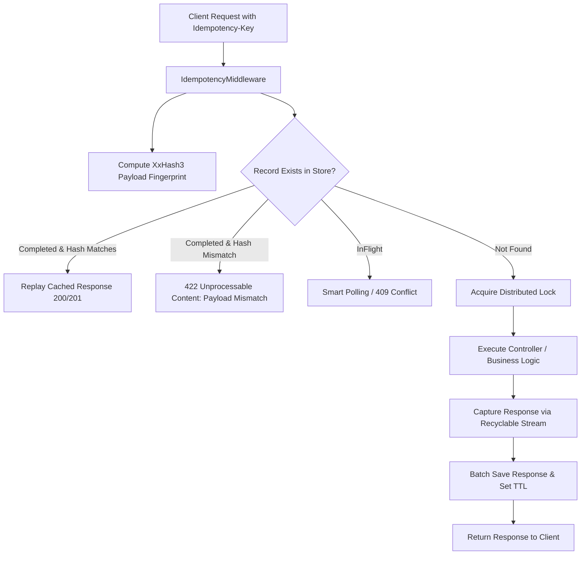

# FastIdempotency

⚡ High-Performance, Distributed Idempotency Middleware for ASP.NET Core (.NET 10).

When network timeouts, client retries, or duplicate webhooks hit your API, duplicate processing can cause critical bugs (such as double-charging a customer or duplicating inventory orders).

**FastIdempotency** guarantees that no matter how many retries arrive with the same `Idempotency-Key` header:
- The operation executes **exactly once**.
- Subsequent duplicate requests receive the **cached response** immediately.
- Payloads are validated against a SIMD-accelerated **XxHash3** fingerprint to reject malicious/accidental key reuse (HTTP `422 Unprocessable Content`).
- Distributed concurrency is safely handled using atomic Lua scripts in **Redis** or row-level locking in **PostgreSQL**.

---

## 📦 Package Ecosystem

FastIdempotency is organized into modular packages so you only install what you need:

| Package | Purpose | Install Command |
| :--- | :--- | :--- |
| **`FastIdempotency.AspNetCore`** | ASP.NET Core middleware, response stream capture, pipeline lifecycle. | `dotnet add package FastIdempotency.AspNetCore` |
| **`FastIdempotency.Storage.Redis`** | Redis distributed store with atomic Lua locking & pipelined hashing. | `dotnet add package FastIdempotency.Storage.Redis` |
| **`FastIdempotency.Storage.Postgres`** | PostgreSQL store with row-level locking & `NpgsqlDataSource` pooling. | `dotnet add package FastIdempotency.Storage.Postgres` |
| **`FastIdempotency.Core`** | Abstractions (`IIdempotencyStore`), models, and SIMD `XxHash3` hasher. | `dotnet add package FastIdempotency.Core` |

---

## 📊 End-to-End Performance Benchmarks

*Hardware: 11th Gen Intel Core i7-11800H @ 2.30GHz (8 cores / 16 threads), .NET 10.0 RyuJIT x64, Windows 11*  
*Benchmarks executed via [BenchmarkDotNet](https://benchmarkdotnet.org/)*

### 1. Redis End-to-End & Store Benchmarks (Live Docker Redis 7)

Tested against a live Redis container with atomic Lua distributed locking and pipelined batch response storage.

| Benchmark Operation | Mean Latency | Gen0 / 1k ops | Gen1 / 1k ops | Allocated Memory |
| :--- | :---: | :---: | :---: | :---: |
| **`Redis Store: SaveCompletedAsync`** (Batch HashSet + Expire) | **6.604 μs** | 0.2747 | 0.1221 | **3.65 KB** |
| **`Pipeline: Cache Hit with Redis`** *(Replay Response)* | **653.317 μs** (~0.65 ms) | — | — | **6.10 KB** |
| **`Redis Store: GetAsync`** (Cache Hit fetch) | **946.250 μs** | — | — | **3.11 KB** |
| **`Redis Store: TryAcquireLockAsync`** (Atomic Lua Lock) | **963.437 μs** | — | — | **1.03 KB** |
| **`Pipeline: Cache Miss with Redis`** *(Lock + Execute + Cache)* | **1,633.261 μs** (~1.63 ms) | — | — | **7.13 KB** |

> **Key takeaway:** FastIdempotency adds sub-millisecond overhead for atomic Redis distributed locking, and short-circuits cache hit replays in **~0.65 ms** total pipeline time with single-digit KB memory allocations.

---

### 2. ASP.NET Core Middleware Pipeline Overhead (In-Memory Baseline)

Measures pure middleware overhead excluding network and disk I/O.

| Scenario | Mean Latency | Gen0 / 1k ops | Allocated Memory | Description |
| :--- | :---: | :---: | :---: | :--- |
| **Passthrough** | **1.067 μs** | 0.1278 | **1.59 KB** | Request without `Idempotency-Key` header |
| **Cache Hit (Replayed)** | **3.712 μs** | 0.2975 | **3.67 KB** | Duplicate request short-circuited & served |
| **Payload Mismatch** | **3.774 μs** | 0.2975 | **3.67 KB** | Fingerprint mismatch -> rejected with 422 |
| **Cache Miss (First Execution)** | **3.827 μs** | 0.2975 | **3.66 KB** | Lock acquire + Controller execution + Stream capture + Store |

---

### 3. Request Fingerprinting (XxHash3 vs Cryptographic Hashes)

FastIdempotency uses SIMD-accelerated **XxHash3** (`System.IO.Hashing`) for zero-allocation, ultra-fast request fingerprinting:

| Hash Algorithm | 128 B Payload | 1 KB Payload | 10 KB Payload | 100 KB Payload | Speedup vs SHA256 |
| :--- | :---: | :---: | :---: | :---: | :---: |
| **XxHash3 (FastIdempotency)** | **152.2 ns** | **252.3 ns** | **629.7 ns** | **5.626 μs** | **Baseline (Up to 18.7x faster)** |
| **SHA256** | 550.2 ns | 1,459.1 ns | 10,909.2 ns | 104.981 μs | ~3.6x - 18.7x slower |
| **MD5** | 876.0 ns | 3,503.3 ns | 30,690.6 ns | 302.698 μs | ~5.8x - 53.8x slower |

---

### 4. Memory Stream Buffering (RecyclableMemoryStream vs Naive MemoryStream)

FastIdempotency uses `Microsoft.IO.RecyclableMemoryStream` to eliminate Large Object Heap (LOH) fragmentation on captured response bodies:

| Response Size | BodyCaptureStream (FastIdempotency) | Naive MemoryStream | Allocated Memory | Allocation Reduction |
| :--- | :---: | :---: | :---: | :---: |
| **1 KB** | **537.8 ns** | 205.9 ns | **1.34 KB** vs 2.11 KB | **36% less memory** |
| **64 KB** | **9.602 μs** | 12.390 μs (1.29x slower) | **64.34 KB** vs 128.11 KB | **50% less memory** |
| **256 KB** | **139.873 μs** | 260.058 μs (1.86x slower) | **256.44 KB** vs 512.16 KB | **50% less memory (Zero LOH)** |

---

## 🚀 Quick Start

### 1. Install via NuGet

```bash
# Core Middleware (Required)
dotnet add package FastIdempotency.AspNetCore

# Choose your Storage Backend:
dotnet add package FastIdempotency.Storage.Redis     # Option A: Redis
# OR
dotnet add package FastIdempotency.Storage.Postgres  # Option B: PostgreSQL
```

### 2. Register Services in `Program.cs`

#### Option A: With Redis
```csharp
using FastIdempotency.AspNetCore;
using FastIdempotency.Storage.Redis;

var builder = WebApplication.CreateBuilder(args);

// Register FastIdempotency with Redis
builder.Services.AddFastIdempotency(options =>
{
    options.HeaderName = "Idempotency-Key";
    options.RetentionWindow = TimeSpan.FromHours(24);
    options.LockTimeout = TimeSpan.FromSeconds(30);
    options.MaxPayloadSizeBytes = 10 * 1024 * 1024; // 10 MB
})
.AddFastIdempotencyRedis(builder.Configuration.GetConnectionString("Redis") ?? "localhost:6379");

var app = builder.Build();

app.UseFastIdempotency();
app.MapControllers();
app.Run();
```

#### Option B: With PostgreSQL
```csharp
using FastIdempotency.AspNetCore;
using FastIdempotency.Storage.Postgres;

var builder = WebApplication.CreateBuilder(args);

// Register FastIdempotency with PostgreSQL (auto-migrates schema on startup)
builder.Services.AddFastIdempotency(options =>
{
    options.HeaderName = "Idempotency-Key";
    options.RetentionWindow = TimeSpan.FromHours(24);
})
.AddFastIdempotencyPostgres(builder.Configuration.GetConnectionString("Postgres")!);

var app = builder.Build();

app.UseFastIdempotency();
app.MapControllers();
app.Run();
```

---

## ⚙️ Configuration Options

| Option | Type | Default | Description |
| :--- | :--- | :--- | :--- |
| `HeaderName` | `string` | `"Idempotency-Key"` | Name of the HTTP header to inspect. |
| `RetentionWindow` | `TimeSpan` | `24 hours` | How long completed responses are cached and replayed. |
| `LockTimeout` | `TimeSpan` | `30 seconds` | Max duration a lock is held before being eligible for expiry. |
| `MaxPayloadSizeBytes` | `long` | `10 MB` | Max allowed request payload size to buffer. |
| `KeyPrefix` | `string` | `"idemp:"` | Key prefix in Redis/Postgres to avoid collisions. |
| `EnableSmartPolling` | `bool` | `true` | When `true`, concurrent in-flight duplicate requests wait and poll for the in-progress response rather than immediately failing with 409. |
| `SmartPollInterval` | `TimeSpan` | `50 ms` | Polling frequency for concurrent in-flight requests. |
| `SmartPollTimeout` | `TimeSpan` | `5 seconds` | Max time a concurrent request will wait for completion. |

---

## 🛠️ Architecture & Features



- **Atomic Distributed Locking**: Redis Lua scripts and PostgreSQL row-level locks prevent race conditions across replica instances.
- **Payload Verification**: SIMD `XxHash3` hashing rejects duplicate keys reused with different payloads (`422 Unprocessable Content`).
- **Zero LOH Allocations**: `Microsoft.IO.RecyclableMemoryStream` pool prevents memory leaks on large response payloads.
- **Pluggable Architecture**: Clear separation of concerns with standalone storage providers.

---

## 🧪 Running Benchmarks & Tests Locally

### Start Redis
```bash
docker run -d --name fastidempotency-redis -p 6379:6379 redis:7-alpine
```

### Run Tests
```bash
dotnet test
```

### Run Benchmarks
```bash
# Run all benchmarks
dotnet run -c Release --project tests/FastIdempotency.Benchmarks -- --filter *

# Run specific suite
dotnet run -c Release --project tests/FastIdempotency.Benchmarks -- --filter *RedisStore*
dotnet run -c Release --project tests/FastIdempotency.Benchmarks -- --filter *Hashing*
dotnet run -c Release --project tests/FastIdempotency.Benchmarks -- --filter *BodyCapture*
```
